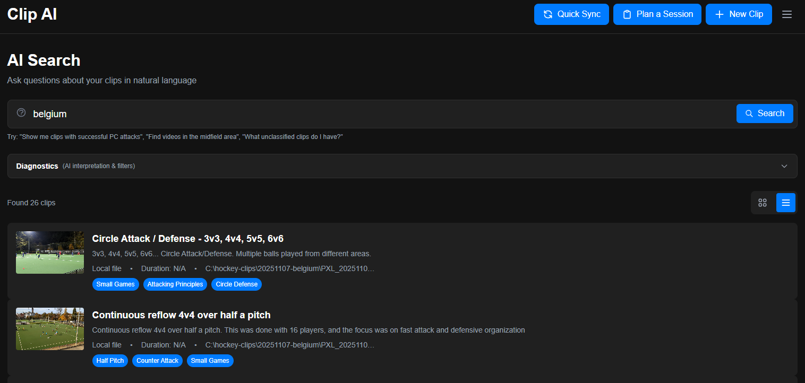

# 🏑 Field Hockey Video Library

A modern video clip management system designed for organizing, tagging, and retrieving field hockey video content. Manage clips from local Windows file paths and YouTube URLs with powerful search and filtering capabilities.



## Overview

Field Hockey Video Library is an MVP application that enables rapid tagging, filtering, and retrieval of video content. The system supports two storage types:

- **Local Files**: Organize clips stored on your Windows file system
- **YouTube Videos**: Manage YouTube clips with automatic metadata retrieval

Key features include:
- 🤖 **AI-Powered Metadata Generation**: Enter notes about a clip and let AI suggest title, description, and tags
- 📝 Structured tagging system (Skill/Tactic, Field Area, Player Role, Outcome/Quality)
- 🔍 Advanced search and multi-tag filtering
- 📺 In-app YouTube playback
- 🎯 Quick access to local video files
- 💾 SQLite database for lightweight, portable storage

## Tech Stack

- **Backend**: ASP.NET Core 8.0 (C#) with Entity Framework Core
- **Database**: SQLite
- **Frontend**: Next.js 16.1 (React 19, TypeScript)
- **Styling**: Tailwind CSS 4
- **API Integration**: YouTube Data API v3

## Prerequisites

Before you begin, ensure you have the following installed:

- [.NET 8.0 SDK](https://dotnet.microsoft.com/download/dotnet/8.0) or later
- [Node.js](https://nodejs.org/) 18.x or later (includes npm)
- [YouTube Data API v3 Key](https://console.cloud.google.com/apis/credentials) (for YouTube clip functionality)
- [Gemini API Key](https://aistudio.google.com/app/apikey) (for AI-powered metadata generation)

## Getting Started

### 1. Clone the Repository

```bash
git clone <repository-url>
cd clip-organizer
```

### 2. Configure the Backend

#### 2.1. Configure API Keys

The backend requires API keys for YouTube and Gemini services. These can be configured in either `appsettings.json` (for all environments) or `appsettings.Development.json` (for development only).

**Location**: `backend/ClipOrganizer.Api/appsettings.json` or `backend/ClipOrganizer.Api/appsettings.Development.json`

**Required Configuration**:

1. **YouTube API Key** (Required for YouTube clip functionality):
   - Get your API key from [Google Cloud Console](https://console.cloud.google.com/apis/credentials)
   - Enable the YouTube Data API v3 for your project
   - Replace `YOUR_YOUTUBE_API_KEY_HERE` with your actual key:
   ```json
   {
     "YouTube": {
       "ApiKey": "your-actual-youtube-api-key-here"
     }
   }
   ```

2. **Gemini API Key** (Required for AI metadata generation):
   - Get your API key from [Google AI Studio](https://aistudio.google.com/app/apikey)
   - Replace `YOUR_GEMINI_API_KEY_HERE` with your actual key:
   ```json
   {
     "Gemini": {
       "ApiKey": "your-actual-gemini-api-key-here",
       "Model": "gemini-1.5-flash"
     }
   }
   ```

   > **Note**: 
   > - The default model is `gemini-1.5-flash` (fast and cost-effective). You can change it to `gemini-1.5-pro` for more capable responses.
   > - If the Gemini API key is not configured, the service will use a fallback method that generates basic metadata (title from first sentence, description from notes, no suggested tags).
   > - For development, you can use `appsettings.Development.json` which overrides `appsettings.json` settings.

#### 2.1.1. Using .NET User Secrets (Recommended for Development)

For development, it's recommended to use .NET User Secrets instead of storing API keys in configuration files. User Secrets are stored outside your project directory and won't be committed to version control.

**Initialize User Secrets**:

1. Navigate to the backend API directory:
   ```bash
   cd backend/ClipOrganizer.Api
   ```

2. Initialize user secrets (only needed once):
   ```bash
   dotnet user-secrets init
   ```

3. Set your API keys:
   ```bash
   # Set YouTube API key
   dotnet user-secrets set "YouTube:ApiKey" "your-youtube-api-key-here"
   
   # Set Gemini API key
   dotnet user-secrets set "Gemini:ApiKey" "your-gemini-api-key-here"
   
   # Optionally set Gemini model (defaults to gemini-1.5-flash)
   dotnet user-secrets set "Gemini:Model" "gemini-1.5-flash"
   ```

4. Verify your secrets are set:
   ```bash
   dotnet user-secrets list
   ```

> **Note**: 
> - User Secrets are automatically loaded in Development mode and override values from `appsettings.json` and `appsettings.Development.json`
> - User Secrets are stored per-user and per-project, so they won't be shared with other developers
> - The secrets are stored in a JSON file outside your project directory (location varies by OS)
> - To remove a secret: `dotnet user-secrets remove "YouTube:ApiKey"`
> - To clear all secrets: `dotnet user-secrets clear`

**Complete Configuration Example** (for appsettings.json):

```json
{
  "Logging": {
    "LogLevel": {
      "Default": "Information",
      "Microsoft.AspNetCore": "Warning"
    }
  },
  "AllowedHosts": "*",
  "ConnectionStrings": {
    "DefaultConnection": "Data Source=clips.db"
  },
  "YouTube": {
    "ApiKey": "your-youtube-api-key-here"
  },
  "Gemini": {
    "ApiKey": "your-gemini-api-key-here",
    "Model": "gemini-1.5-flash"
  }
}
```

#### 2.2. Database Configuration

The SQLite database is automatically created on first run. The database file (`clips.db`) will be created in the `backend/ClipOrganizer.Api` directory. No additional database setup is required.

**Connection String** (already configured in `appsettings.json`):
```json
{
  "ConnectionStrings": {
    "DefaultConnection": "Data Source=clips.db"
  }
}
```

#### 2.3. Install Backend Dependencies

1. Navigate to the backend directory:
   ```bash
   cd backend/ClipOrganizer.Api
   ```

2. Restore NuGet packages:
   ```bash
   dotnet restore
   ```
   
   > **Note**: This is usually automatic on first run, but you can run it manually if needed.

#### 2.4. Run the Backend

```bash
dotnet run
```

The API will start on:
- **HTTP**: `http://localhost:5059`
- **HTTPS**: `https://localhost:7161` (if using HTTPS profile)

> **Note**: 
> - Swagger UI is available at `http://localhost:5059/swagger` in development mode
> - The database will be automatically created and migrated on first run
> - To auto-reload on code changes, use `dotnet watch run`

### 3. Configure the Frontend

#### 3.1. Install Frontend Dependencies

1. Navigate to the frontend directory:
   ```bash
   cd frontend
   ```

2. Install npm packages:
   ```bash
   npm install
   ```

#### 3.2. Configure API URL (Optional)

The frontend defaults to `http://localhost:5059` for the API URL. If your backend is running on a different URL or port, create a `.env.local` file in the `frontend` directory:

```env
NEXT_PUBLIC_API_URL=http://localhost:5059
```

> **Note**: 
> - This file is git-ignored and won't be committed to version control
> - The default value (`http://localhost:5059`) works for standard development setups
> - Only change this if your backend runs on a different URL/port

#### 3.3. Run the Frontend

```bash
npm run dev
```

The frontend will be available at `http://localhost:3000`.

> **Note**: The frontend will automatically reload when you make code changes.

### 4. Access the Application

Once both backend and frontend are running, open your browser and navigate to:

- **Frontend Application**: http://localhost:3000
- **API Swagger UI**: http://localhost:5059/swagger (for API documentation and testing)

### 5. Verify Configuration

To verify everything is configured correctly:

1. **Backend**: Check that the API starts without errors and Swagger UI loads
2. **Frontend**: Check that the application loads and can connect to the backend
3. **YouTube API**: Try adding a YouTube clip to verify the YouTube API key works
4. **Gemini API**: Try using the "Generate with AI" feature to verify the Gemini API key works

If you see errors, refer to the [Troubleshooting](#troubleshooting) section below.

## Project Structure

```
clip-organizer/
├── backend/
│   └── ClipOrganizer.Api/
│       ├── Controllers/        # API endpoints
│       ├── Data/               # Database context
│       ├── DTOs/               # Data transfer objects
│       ├── Models/             # Domain models
│       ├── Services/           # Business logic services
│       └── Program.cs          # Application entry point
│
└── frontend/
    ├── app/                    # Next.js app router pages
    ├── components/             # React components
    ├── lib/api/                # API client functions
    └── types/                  # TypeScript type definitions
```

## Usage

### Adding a Clip

1. Click "Add New Clip" or navigate to `/clips/new`
2. **Using AI (Recommended)**:
   - Enter your notes about the clip in the "Your Notes about the Clip" field
   - Click "Generate with AI" to automatically generate:
     - Title
     - Description
     - Suggested tags (pre-selected)
   - Review and edit the AI-generated content as needed
   - Enter the location (file path or YouTube URL)
   - Click "Save Clip"
3. **Manual Entry**:
   - Enter the location (file path or YouTube URL)
   - Manually add title, description, and tags
   - Click "Save Clip"

**Storage Types**:
- **Local**: Enter a Windows file path (e.g., `C:\Videos\clip.mp4`)
- **YouTube**: Enter a YouTube URL or video ID

**Tag Categories**:
- Skill/Tactic (e.g., Flick, PC Attack)
- Field Area (e.g., Attacking D, Midfield)
- Player Role (e.g., Defender, Goalie)
- Outcome/Quality (e.g., Success, Error)

### Searching and Filtering

- Use the search bar to find clips by title
- Use the filter sidebar to filter by multiple tags simultaneously
- Combine search terms with tag filters for precise results

### Viewing Clips

- **YouTube Clips**: Play directly in the embedded player
- **Local Clips**: Play directly in the embedded video player

**Supported Video Formats**: MP4, WebM, OGG, MOV, AVI

The video player supports standard controls including play, pause, seek, volume adjustment, and fullscreen mode. For local clips, the file path is also displayed below the player for reference.

## Development

### Backend Development

```bash
cd backend/ClipOrganizer.Api
dotnet watch run  # Auto-reload on changes
```

### Frontend Development

```bash
cd frontend
npm run dev  # Auto-reload on changes
```

### Database

The SQLite database (`clips.db`) is automatically created in the `backend/ClipOrganizer.Api` directory on first run. The database schema is managed by Entity Framework Core using `EnsureCreated()`, which automatically creates the database and tables based on your models.

**Database Location**: `backend/ClipOrganizer.Api/clips.db`

**Note**: The database file and its associated files (`clips.db-shm`, `clips.db-wal`) are created automatically. To reset the database, simply delete these files and restart the backend.

## API Endpoints

The API exposes the following main endpoints:

- `GET /api/clips` - Get all clips (with optional search and filter)
- `GET /api/clips/{id}` - Get a specific clip
- `GET /api/clips/{id}/video` - Stream video file for local clips
- `POST /api/clips` - Create a new clip
- `PUT /api/clips/{id}` - Update a clip
- `POST /api/clips/generate-metadata` - Generate AI metadata (title, description, tags) from notes
- `GET /api/tags` - Get all tags grouped by category
- `POST /api/tags` - Create a new tag

See the Swagger UI at `http://localhost:5059/swagger` for complete API documentation.

## Configuration Reference

### Backend Configuration Files

- **`appsettings.json`**: Main configuration file (used in all environments)
- **`appsettings.Development.json`**: Development-specific overrides (takes precedence in Development mode)
- **`.NET User Secrets`**: Development-only secrets stored outside the project (highest precedence in Development mode)
- **`launchSettings.json`**: Launch profiles and port configuration

**Configuration Precedence** (in Development mode, from lowest to highest):
1. `appsettings.json`
2. `appsettings.Development.json`
3. `.NET User Secrets` (recommended for sensitive data like API keys)

### Frontend Configuration

- **`.env.local`**: Environment variables (optional, git-ignored)
  - `NEXT_PUBLIC_API_URL`: Backend API URL (default: `http://localhost:5059`)

### Environment Variables

The application uses the following environment variables:

**Backend**:
- `ASPNETCORE_ENVIRONMENT`: Set to `Development` by default in launch settings

**Frontend**:
- `NEXT_PUBLIC_API_URL`: Backend API URL (optional, defaults to `http://localhost:5059`)

### Port Configuration

**Default Ports**:
- Backend HTTP: `5059`
- Backend HTTPS: `7161`
- Frontend: `3000`

To change ports:
- **Backend**: Edit `backend/ClipOrganizer.Api/Properties/launchSettings.json`
- **Frontend**: Use `npm run dev -- -p <port>` or set `PORT` environment variable

## Troubleshooting

### Backend Issues

- **Database locked**: 
  - Ensure only one instance of the API is running
  - Close any database viewers or tools that might have the database open
  - Delete `clips.db-shm` and `clips.db-wal` files if they exist

- **YouTube API errors**: 
  - Verify your API key is correct in `appsettings.json` or user secrets
  - If using user secrets, verify with: `dotnet user-secrets list`
  - Ensure YouTube Data API v3 is enabled in your Google Cloud project
  - Check your API quota and billing status
  - Verify the API key has the correct permissions

- **Gemini API errors**: 
  - Verify your Gemini API key is correct in `appsettings.json` or user secrets
  - If using user secrets, verify with: `dotnet user-secrets list`
  - Check your API quota at [Google AI Studio](https://aistudio.google.com/app/apikey)
  - The service will use a fallback method if the API key is missing or invalid (basic metadata generation)
  - Ensure the model name is correct (`gemini-1.5-flash` or `gemini-1.5-pro`)

- **Port already in use**: 
  - Change the port in `backend/ClipOrganizer.Api/Properties/launchSettings.json`
  - Or kill the process using the port:
    ```bash
    # Windows
    netstat -ano | findstr :5059
    taskkill /PID <PID> /F
    ```

- **NuGet package restore fails**:
  ```bash
  cd backend/ClipOrganizer.Api
  dotnet clean
  dotnet restore
  ```

### Frontend Issues

- **Cannot connect to API**: 
  - Ensure the backend is running on `http://localhost:5059`
  - Check that `NEXT_PUBLIC_API_URL` in `.env.local` matches your backend URL
  - Verify the backend is accessible by visiting `http://localhost:5059/swagger` in your browser

- **CORS errors**: 
  - Verify CORS is configured in `Program.cs` to allow `http://localhost:3000`
  - Ensure the frontend URL matches the CORS configuration
  - Check browser console for specific CORS error messages

- **Video playback not working**:
  - Ensure the video file path is accessible from the backend server
  - Verify the file exists at the specified path
  - Check that the file format is supported (MP4, WebM, OGG, MOV, AVI)
  - Ensure the browser supports the video format (MP4 is most widely supported)
  - Check browser console for specific error messages
  - Verify the backend API is running and accessible
  - For large files, ensure range requests are working (check network tab for 206 Partial Content responses)

- **Video format not supported**:
  - MP4 (H.264) is the most widely supported format across browsers
  - If a video doesn't play, try converting it to MP4 format
  - Check browser compatibility for WebM, OGG, MOV, and AVI formats

- **Build errors**:
  ```bash
  cd frontend
  rm -rf node_modules .next
  npm install
  npm run dev
  ```

- **TypeScript errors**:
  - Ensure all dependencies are installed: `npm install`
  - Check that TypeScript version is compatible: `npm list typescript`

### Common Fixes

1. **Clear and rebuild**:
   ```bash
   # Backend
   cd backend/ClipOrganizer.Api
   dotnet clean
   dotnet build
   
   # Frontend
   cd frontend
   rm -rf node_modules .next
   npm install
   ```

2. **Reset database**: Delete `clips.db`, `clips.db-shm`, and `clips.db-wal` files and restart the API

## License

[Add your license here]

## Contributing

[Add contribution guidelines here]

